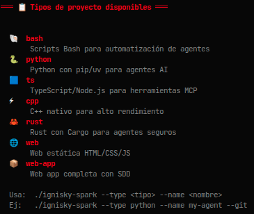

# 🔥 ignisky-spark — La chispa inicial de tu workspace AI

<p align="center">
  <a href="LICENSE"></a>
  <a href="https://hermes-agent.nousresearch.com"></a>
  <a href="https://github.com/yosoyignicion"></a>
  <a href=".github/workflows/lint.yml"></a>
  <a href="https://ignaciodev.gumroad.com/l/ignisky-spark-premium"></a>
</p>

> **ignisky-spark** es un scaffold inteligente para inicializar workspaces de agentes AI. Crea al instante la estructura de proyecto perfecta para que Claude Code, Codex CLI, Hermes Agent o cualquier otro agente empiece a trabajar sin fricción.

---

## 📸 Capturas

<p align="center">
  
  <br>
  <sub>7 tipos de proyecto disponibles 🔥</sub>
</p>

---

## 📦 Instalación

```bash
# 1. Clona el repositorio
git clone https://github.com/yosoyignicion/ignisky-spark.git
cd ignisky-spark

# 2. Hazlo ejecutable
chmod +x ignisky-spark.sh

# 3. (Opcional) Instálalo en tu PATH
make install
```

**Requisitos:** Bash 4+ (viene en cualquier Linux/macOS moderno).

---

## 🚀 Uso rápido

```bash
# Modo interactivo (recomendado para empezar)
./ignisky-spark.sh

# Workspace Python con Git
./ignisky-spark.sh --type python --name my-agent --git

# Workspace TypeScript con instalación de dependencias
./ignisky-spark.sh --type ts --name mcp-server --git --install

# Web app completa con SDD
./ignisky-spark.sh --type web-app --name my-app --author "Tu Nombre" --desc "App genial"

# Añadir CI/CD a un proyecto existente
./ignisky-spark.sh --ci --dir /ruta/del/proyecto
```

---

## 📋 Tipos de proyecto

| Tipo | Lenguaje | Icono |
|------|----------|-------|
| `bash` | Scripts Bash para automatización de agentes | 🐚 |
| `python` | Python con pip/uv para agentes AI | 🐍 |
| `ts` | TypeScript/Node.js para herramientas MCP | 🟦 |
| `cpp` | C++ nativo para alto rendimiento | ⚡ |
| `rust` | Rust con Cargo para agentes seguros | 🦀 |
| `web` | Web estática HTML/CSS/JS | 🌐 |
| `web-app` | Web app completa con SDD | 📦 |

Cada tipo genera automáticamente `src/`, `tests/`, `docs/`, `.gitignore`, `README.md`, **`CLAUDE.md`** y **`AGENTS.md`** — contexto listo para que tu agente entienda el proyecto desde el primer `cd`.

---

## 🆓 Funciones Gratis

| Comando | Descripción |
|---------|-------------|
| `--type <lenguaje>` | Elige entre 7 tipos de proyecto |
| `--name <nombre>` | Nombre del proyecto |
| `--author <autor>` | Personaliza el autor (default: git user.name) |
| `--desc <desc>` | Descripción breve del proyecto |
| `--git` | Inicializa repo Git + commit inicial |
| `--install` | Instala dependencias (pip/npm/cargo) |
| `--list` | Lista los tipos disponibles |
| `--help` / `-h` | Muestra la ayuda completa |

---

## 💎 Funciones Premium

| Comando | Feature | Descripción |
|---------|---------|-------------|
| `--ci` | **spark:blast** | CI/CD (GitHub Actions) + Dockerfile multi-stage + .dockerignore |
| `--make` | **spark:forge** | Makefile con 10 targets (build/test/clean/lint/run/docker...) |
| `--bootstrap` | **spark:env** | Detecta herramientas instaladas y las instala si faltan |
| `--templates` | **spark:kit** | Editorconfig + Prettier/ESLint/ruff/clang-format/rustfmt según tipo |

```bash
# Ejemplos de uso premium:
./ignisky-spark.sh --ci --dir ./mi-proyecto
./ignisky-spark.sh --make --dir ./mi-proyecto
./ignisky-spark.sh --templates --dir ./mi-proyecto
./ignisky-spark.sh --bootstrap python
```

Las funciones premium se aplican **tanto en proyectos nuevos como existentes** — usa `--dir <ruta>` para añadirlas a cualquier proyecto.

> 🏷️ **Cupón exclusivo:** `IGNICION25` — 25% OFF en el pack premium

<p align="center">
  <a href="https://ignaciodev.gumroad.com/l/ignisky-spark-premium">
    
  </a>
  <br>
  <sub>Código <code>IGNICION25</code> → 25% OFF (11.25€)</sub>
</p>

---

## 🎮 Modo Interactivo

Ejecuta `./ignisky-spark.sh` sin argumentos para entrar en el menú guiado:

```
┌─ ¿Qué quieres hacer? ───────────────────────────┐
│  1  🔥  Crear nuevo workspace                   │
│  2  📋  Ver tipos de proyecto disponibles        │
│  3  💎  Ver funciones premium                    │
│  0  🚪  Salir                                   │
└──────────────────────────────────────────────────┘
```

Dentro de "Crear nuevo workspace" se te guiará paso a paso: elegir tipo, nombre, autor, descripción y extras como Git init o instalación de dependencias.

---

## 📂 Estructura generada (ejemplo: TypeScript)

```
mi-proyecto/
├── src/           # Código fuente
├── tests/         # Tests
├── docs/          # Documentación
├── .gitignore     # Optimizado para agentes AI
├── CLAUDE.md      # Contexto para Claude Code / Hermes Agent
├── AGENTS.md      # Contexto multi-agente (Cursor, Windsurf, Copilot)
└── README.md      # README template con badges 🔥
```

Para `web-app` se genera además `docs/sdd.md` (Software Design Document) con plantilla profesional.

---

## 🤖 Prompt para Hermes Agent

```bash
# Copia y pega esto en tu chat de Hermes Desktop:
Usa ignisky-spark para crear workspace --type python --name mi-proyecto --git
```

Si tienes spark en el PATH, Hermes puede invocarlo directamente para scaffolding rápido.

---

## 🔗 Ecosistema ignisky-*

Este script forma parte de una suite de herramientas para agentes AI:

| Herramienta | Función | Estado |
|-------------|---------|--------|
| [**ignisky-kindler**](https://github.com/yosoyignicion/ignisky-kindler) | Configuración y monitorización de MCPs | ✅ Disponible |
| [**ignisky-spark**](https://github.com/yosoyignicion/ignisky-spark) | **🏠 Este script** — Scaffolding de workspaces AI | ✅ v1.0.1 |
| [**ignisky-forge**](https://github.com/yosoyignicion/ignisky-forge) | Gestión de perfiles Hermes Agent | ✅ Disponible |
| [**ignisky-embers**](https://github.com/yosoyignicion/ignisky-embers) | Auditoría de seguridad del filesystem expuesto al agente | 🔄 En desarrollo |

---

## 📬 Feedback

¿Bugs, sugerencias o quieres proponer un tipo de proyecto nuevo?

- **Issues:** [github.com/yosoyignicion/ignisky-spark/issues](https://github.com/yosoyignicion/ignisky-spark/issues)

---

<p align="center">
  <sub>Hecho con 🔥 por <a href="https://github.com/yosoyignicion">IgnicionDev</a>
  · <a href="https://yosoyignicion.github.io/portafolio">Portafolio</a></sub>
  <br>
  <sub>Parte del ecosistema <b>ignisky-*</b> · Paleta Ignición #ED2100 · #050505</sub>
</p>
